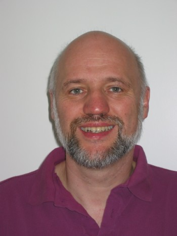
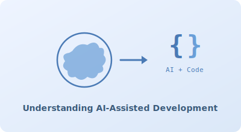
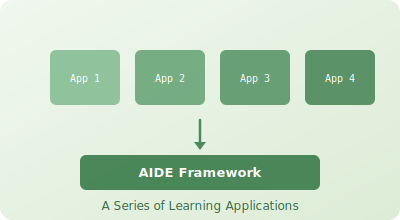
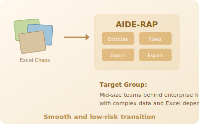
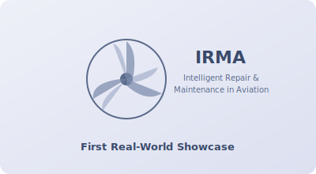
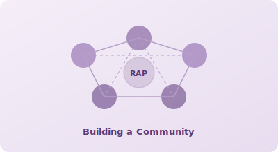
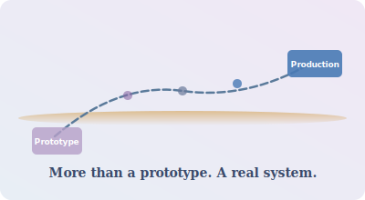

# Background

About the author and his motivation.

## Dr. Gero Scholz

- Retired IT professional
- Diploma and doctorate in business economics (operations research)
- Head of IT development at Dresdner Bank, Frankfurt
- CIO at a software house, Berlin (public transport sector)
- Book author
- Consultant

## Motivation

- Understand the potential and implications of AI-assisted software development
- Create useful applications with AI as a means to learn and teach how agent-based development works
- Explore the limits of this new approach

## First Results: Playground Apps

- A series ("AIDE") of small applications for didactical purposes
- AIDE = Artificial Intelligence for Development Engineers
- A framework for building larger applications

## Second Result: RAP - A Platform for Solution Building

- RAP ("**rapid productivity**")
- AIDE-RAP is a mid-size open source **platform tool** that can be used to create showcases or even real software solutions for a *specific target group*
- The target group consists of mid-size teams working behind an enterprise firewall with a rich set of complex data
- Such teams tend to create ambitious Excel landscapes that are highly dependent on key people
- Their current home-grown solutions often suffer from redundancies, inconsistencies, lack of version control, reliance on individual desktop systems, and weak integration into the enterprise landscape
- These "systems" might be perceived as a *semi-private dominion* from the perspective of a large enterprise striving for stable, mature processes
- If the contribution of such a team is truly relevant for enterprise success and/or if it handles critical data, then responsible managers see the necessity to establish a real software system that supports well-defined work processes
- AIDE-RAP is a tool that makes such a transition **smooth and low-risk** because at a very early phase in the project it can demonstrate what the new platform solution will look like. Many people can contribute to the design of a new system once they SEE a preliminary version and can PLAY with it based on semi-realistic DATA. Without such a "RAP demo", many team members will not be motivated to read and review complicated specification documents. But once the new system is in place, they may discover that only half of the needed functionality is there - and that there are functions they will probably never use.

## Third Result: RAP IRMA

- IRMA = Intelligent Repair & Maintenance in Aviation
- Details described in a separate document

## Future

- I am interested in demonstrating the power of AI-driven solution creation
- I want to find support for AIDE-RAP
- I want to find people and enterprises willing to use AIDE-RAP for their purposes
- I prefer ambitious enterprises seeking for organisational maturity
- I would like to help them with the first steps

## Vision

- I would like to see whether AIDE-RAP can be more than a tool for creating showcase prototypes that act as a spec for "real systems" which thereafter will be built in the conventional way
- My whole professional experience tells me that this would require several major steps of investment into RAP
- **My 40 years of instinct in IT development tell me that it is possible.**
