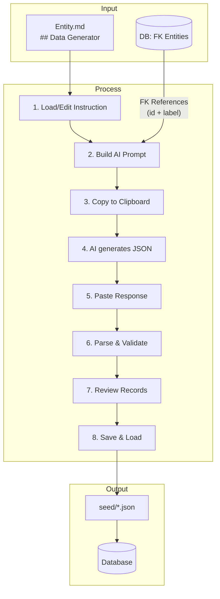
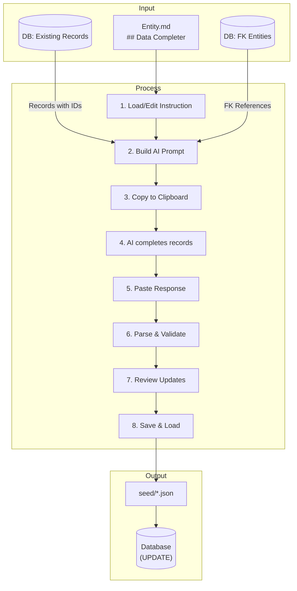
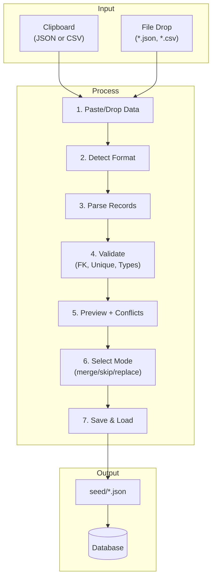
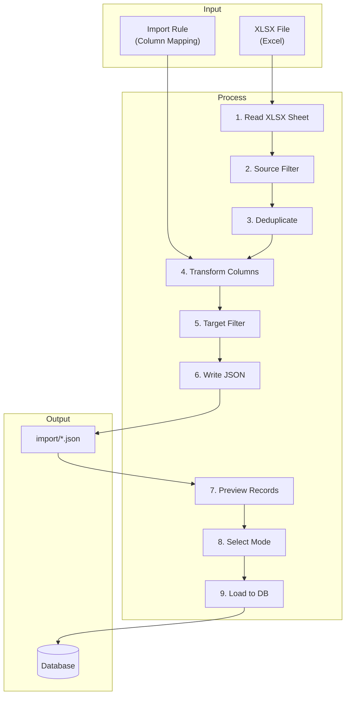
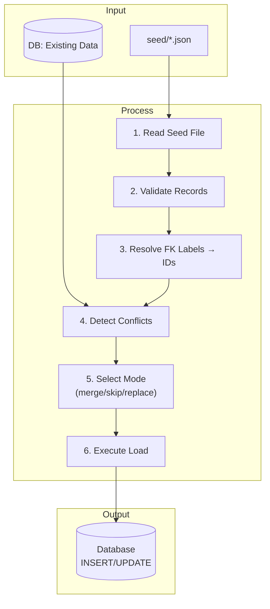
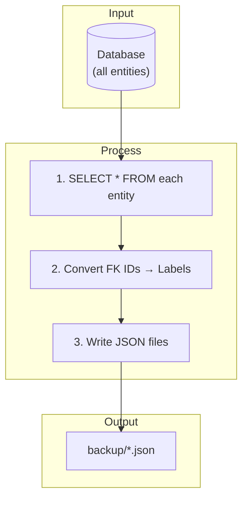
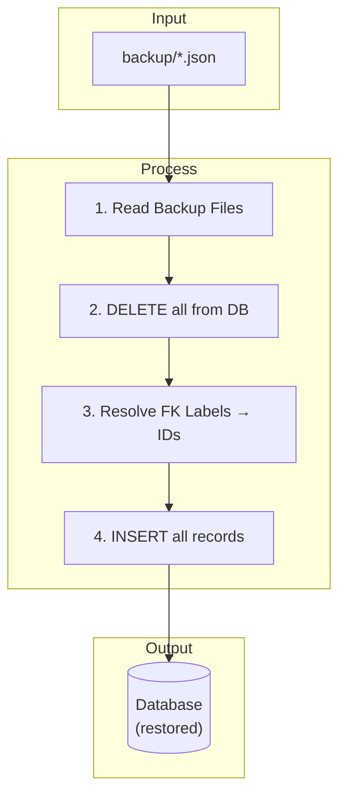
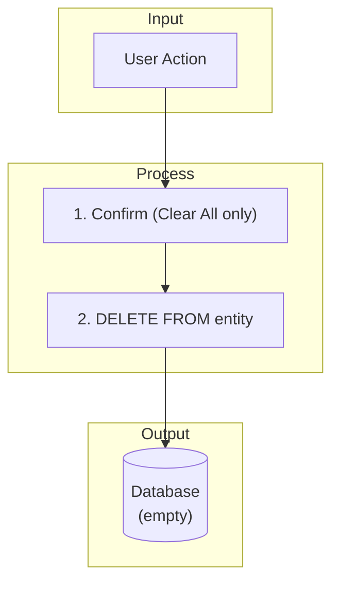
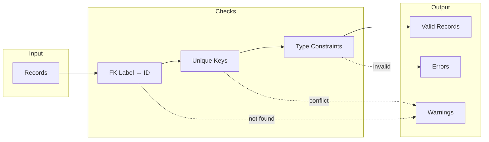

# Import & Seed Data Workflows

Each workflow described with block diagrams showing data flow top-to-bottom, inputs from left.

---

## 1. Generate (AI-assisted Record Creation)



**Prompt contains:**
| Section | Source |
|---------|--------|
| Entity Schema | Columns, types, constraints |
| Type Definitions | Patterns, enums |
| Instruction | `## Data Generator` |
| FK References | All records from referenced entities |
| Back-References | Entities that reference this one |
| Seed Context | `## Seed Context` section |

---

## 2. Complete (AI-assisted Attribute Completion)



**Key difference:** Prompt includes existing records with IDs. AI fills NULL values. IDs must stay unchanged for UPDATE.

---

## 3. Import (Manual JSON/CSV Paste)



---

## 4. Import by Rule (XLSX Conversion)



---

## 5. Load Seed



---

## 6. Backup



---

## 7. Restore



---

## 8. Clear



---

## Load Modes

| Mode | SQL | Use Case |
|------|-----|----------|
| **replace** | `INSERT OR REPLACE` | Overwrite everything |
| **merge** | `UPDATE` + `INSERT` | Add changes (default) |
| **skip_conflicts** | `INSERT` new only | Protect existing |

---

## Validation Pipeline



---

## Directory Structure

```
app/systems/<system>/data/
├── seed/              ← Versioned seed files
├── import/            ← XLSX conversions (generated)
├── backup/            ← DB snapshots (gitignored)
└── rap.sqlite         ← Database (gitignored)
```
