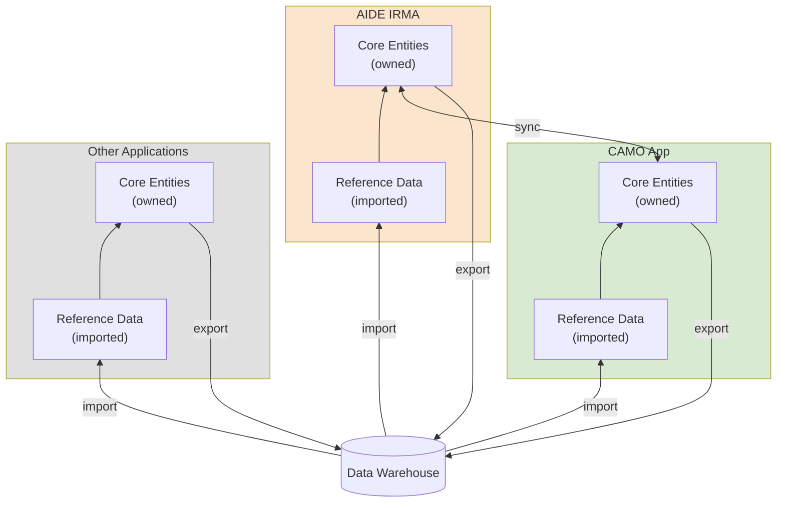

# AIDE IRMA – User Guide

**Intelligent Repair and Maintenance in Aviation**

---

## Overview

IRMA is a demonstration application for managing the process of engine maintenance in aviation. It showcases the capabilities of the AIDE rapid application development framework.

AIDE IRMA could be used to design a real IT system which supports the planning and control of engine repair and maintenance. Such a system would presumably import all its reference data from a data warehouse or from existing neighbor systems. It would own its core entities and export some portion of them to the data warehouse so they could be used by other applications as their reference data.

---

## Navigation

### Menu Bar
- **Data Model**: View entity documentation
- **Layout Editor**: Edit diagram layouts
- **Sort**: Attribute order and reference positioning
- **IDs**: Toggle technical ID display
- **↻**: Toggle cycle reference visibility
- **Admin**: Seed data management

### Entity Explorer (Left)
- **View modes**: Table, Tree (horizontal), Tree (vertical)
- **Entity selector**: Dropdown grouped by area
- **Right-click**: Context menu for actions

### Detail Panel (Right)
- Opens via context menu (right-click → Details)
- View mode (read-only) or Edit mode

---

## Working with Data

### CRUD Operations
- **Create**: Right-click → New, or use New button
- **Read**: Click record to select, right-click → Details
- **Update**: Right-click → Edit, modify fields, Save
- **Delete**: Right-click → Delete (blocked if referenced)

### Tree View
- **▶** expands foreign key references
- **Back-references** show incoming links
- **↻** marks cycles (toggle visibility in menu)

### Export
- **PDF**: Export table or tree view
- **CSV**: Export table data

---

## Data Model

### Areas of Competence
Entities are grouped by domain:
- **Engine Management** (orange): Engine, Workscope, Transport
- **Maintenance & Repair** (purple): MRO, RepairOrder, Task
- **Operations** (green): Airline, Operator, Aircraft, CAMO
- **OEM** (blue): AircraftType, EngineType, MaintenancePlan

### Validation
- Required fields marked with *
- Pattern validation (e.g., aircraft registration D-XXXX)
- Enum fields with predefined values
- Foreign keys must reference existing records

---

## Admin Tools

### Seed Manager
- **Load/Clear**: Import or reset entity data
- **Export**: Download as JSON
- **Generate**: LLM-based data generation

---

## About

IRMA is built with the [AIDE Framework](/about) – a rapid application development platform that generates applications from Markdown-based data models.
